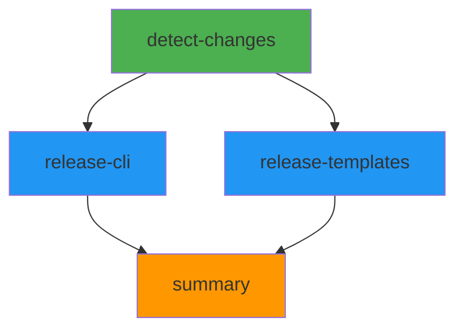

# Semantic Release Workflow Modifications

## Overview

The main semantic-release orchestrator workflow has been modified to support per-template releases with change detection and parallel execution. This enables independent versioning and releasing of the CLI and each template package.

## Key Changes

### 1. Added Change Detection Job

**Job Name:** `detect-changes`

**Purpose:** Detect which packages have changes since their last release

**Outputs:**
- `cli`: Boolean indicating if CLI has changes
- `devcontainer`: Boolean indicating if devcontainer template has changes
- `claude-dotnet-9`: Boolean indicating if claude-dotnet-9 template has changes
- `claude-dotnet-10-full`: Boolean indicating if claude-dotnet-10-full template has changes
- `pks-fullstack`: Boolean indicating if pks-fullstack template has changes
- `has-templates`: Boolean indicating if any template has changes
- `template-matrix`: JSON matrix configuration for templates with changes

**Implementation:**
- Uses the `scripts/detect-changes.sh` script to detect changes
- Parses JSON output using `jq`
- Dynamically builds matrix JSON for templates that need releases
- Generates a summary report showing which packages have changes

### 2. Added CLI Release Job

**Job Name:** `release-cli`

**Purpose:** Release the CLI package independently

**Trigger:** Only runs if `detect-changes.outputs.cli == 'true'`

**Implementation:**
- Uses the reusable workflow `.github/workflows/release-cli.yml`
- Depends on the `detect-changes` job
- Inherits secrets from parent workflow
- Conditionally skipped if no CLI changes detected

### 3. Added Template Release Job

**Job Name:** `release-templates`

**Purpose:** Release template packages in parallel

**Trigger:** Only runs if `detect-changes.outputs.has-templates == 'true'`

**Matrix Configuration:**
```yaml
strategy:
  matrix: ${{ fromJson(needs.detect-changes.outputs.template-matrix) }}
  fail-fast: false
```

**Matrix Includes (when changes detected):**
- `devcontainer`:
  - template_path: `templates/devcontainer`
  - package_id: `PKS.Templates.DevContainer`
  - config_file: `.releaserc.templates.devcontainer.json`

- `claude-dotnet-9`:
  - template_path: `templates/claude-dotnet-9`
  - package_id: `PKS.Templates.ClaudeDotNet9`
  - config_file: `.releaserc.templates.claude-dotnet-9.json`

- `claude-dotnet-10-full`:
  - template_path: `templates/claude-dotnet-10-full`
  - package_id: `PKS.Templates.ClaudeDotNet10.Full`
  - config_file: `.releaserc.templates.claude-dotnet-10-full.json`

- `pks-fullstack`:
  - template_path: `templates/pks-fullstack`
  - package_id: `PKS.Templates.PksFullstack`
  - config_file: `.releaserc.templates.pks-fullstack.json`

**Implementation:**
- Uses the reusable workflow `.github/workflows/release-template.yml`
- Depends on the `detect-changes` job
- Runs in parallel using matrix strategy
- `fail-fast: false` ensures all templates are processed even if one fails
- Inherits secrets from parent workflow
- Conditionally skipped if no template changes detected

### 4. Added Summary Job

**Job Name:** `summary`

**Purpose:** Aggregate results from all release jobs and generate a comprehensive summary

**Trigger:** Always runs (using `if: always()`)

**Dependencies:**
- `detect-changes`
- `release-cli`
- `release-templates`

**Implementation:**
- Checks results from all jobs
- Generates a comprehensive summary showing:
  - Job status table
  - All releases created (CLI and templates)
  - Package details (name, version, tag)
  - Links to GitHub releases and NuGet packages
  - Installation instructions for released packages
- Handles cases where no releases were created

## Workflow Structure



## Benefits

1. **Independent Versioning:** Each package can have its own version number and release schedule
2. **Parallel Execution:** Templates are released in parallel, reducing overall workflow time
3. **Change Detection:** Only packages with actual changes are processed
4. **Efficient CI/CD:** Skips unnecessary builds and releases
5. **Better Traceability:** Clear summary of what was released in each workflow run
6. **Reduced Risk:** Template releases don't affect CLI releases and vice versa

## Preserved Features

- **Triggers:** Push to main/vnext/develop branches, manual workflow dispatch
- **Permissions:** All necessary GitHub permissions maintained
- **Environment Variables:** .NET configuration preserved
- **Secret Inheritance:** All jobs inherit secrets properly
- **Existing Release Configs:** Uses existing `.releaserc*.json` configurations

## Testing Recommendations

1. **Test with CLI changes only:**
   - Make changes to `src/` directory
   - Push to branch
   - Verify only CLI release job runs

2. **Test with template changes only:**
   - Make changes to `templates/devcontainer/` directory
   - Push to branch
   - Verify only devcontainer template release job runs

3. **Test with multiple template changes:**
   - Make changes to multiple template directories
   - Push to branch
   - Verify parallel execution of multiple template releases

4. **Test with no changes:**
   - Push a commit that doesn't affect any packages
   - Verify all release jobs are skipped
   - Verify summary shows "No Releases Created"

5. **Test with CLI and template changes:**
   - Make changes to both CLI and template directories
   - Push to branch
   - Verify both CLI and template releases execute

## Migration Notes

- **No Breaking Changes:** Existing release configurations remain unchanged
- **Backward Compatible:** Uses same reusable workflows (release-cli.yml, release-template.yml)
- **Same Triggers:** Workflow triggers remain identical
- **Same Permissions:** No permission changes required

## File Locations

- **Main Workflow:** `.github/workflows/semantic-release.yml`
- **CLI Reusable Workflow:** `.github/workflows/release-cli.yml`
- **Template Reusable Workflow:** `.github/workflows/release-template.yml`
- **Change Detection Script:** `scripts/detect-changes.sh`
- **Release Configs:** `.releaserc*.json` files in repository root
