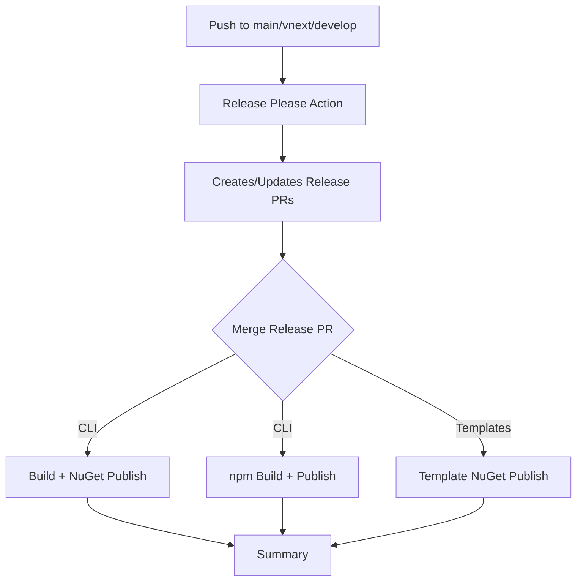

# CLAUDE.md

This file provides guidance to Claude Code (claude.ai/code) when working with code in this repository.

## Project Overview

PKS CLI is a .NET 10 console application built with Spectre.Console that provides an agentic CLI tool for .NET developers. It combines beautiful terminal UI with AI-powered development assistance and Kubernetes deployment capabilities.

**Repository**: https://github.com/pksorensen/pks-cli

## Getting Started

### TL;DR - Just Install It

```bash
# One command to install PKS CLI
./install.sh

# Start using it immediately
pks init MyFirstProject
```

That's it! The script handles everything else automatically.

## Quick Start

### New Users - Installation

For users who want to install and use PKS CLI:

```bash
# Simple one-command installation
./install.sh

# Force reinstall if already installed
FORCE_INSTALL=true ./install.sh

# Get help and see all options
./install.sh --help
```

The install script handles everything: validates .NET, builds the solution, creates packages, and installs as a global tool.

### Developers - Development Commands

For development work on PKS CLI itself:

```bash
# Build and test during development
dotnet build PKS.CLI.sln
dotnet test

# Run locally without installing
cd src
dotnet run -- [command] [options]

# Example: Run init command locally
dotnet run -- init MyTestProject --template console
```

## Installation Options

### Automated Installation (Recommended)

The `install.sh` script provides a complete, automated installation experience:

```bash
# Standard installation
./install.sh

# Available environment variables
FORCE_INSTALL=true ./install.sh     # Overwrite existing installation
CONFIGURATION=Debug ./install.sh    # Use Debug configuration
```

**What the script does:**
1. ✅ Validates .NET 10+ is installed
2. 🔨 Builds the entire solution (CLI + Templates)
3. 📦 Creates NuGet packages for distribution
4. 🌍 Installs PKS CLI as a global .NET tool
5. ✔️ Verifies installation and provides usage tips

### Manual Installation (Development)

For development scenarios or manual control:

```bash
# Navigate to source directory
cd src

# Build and package
dotnet build --configuration Release
dotnet pack --configuration Release

# Install as global tool
dotnet tool install -g --add-source ./bin/Release pks-cli --force

# Verify installation
pks --help
```

### NuGet Installation (.NET Global Tool)

PKS CLI is published to NuGet.org as a .NET global tool:

```bash
# Install stable release
dotnet tool install -g pks-cli

# Install prerelease (vnext/develop)
dotnet tool install -g pks-cli --version 1.0.0-rc.1 --prerelease

# Update to latest
dotnet tool update -g pks-cli

# Run without installing (dotnet's version of npx)
dotnet tool run pks-cli init MyProject
dotnet tool run --prerelease pks-cli init MyProject -- --agentic --mcp
```

**Release Channels:**
- Stable versions: `dotnet tool install -g pks-cli`
- Prereleases: Use `--prerelease` flag with specific version

### npm Installation (Cross-Platform)

For users without .NET SDK, PKS CLI is also available via npm with multi-channel support:

```bash
# Stable release (recommended)
npm install -g @pks-cli/pks

# Release candidate (testing)
npm install -g @pks-cli/pks@rc

# Development version (bleeding edge)
npm install -g @pks-cli/pks@dev

# Or use with npx (no installation required)
npx @pks-cli/pks init MyProject
npx @pks-cli/pks@rc init MyProject
npx @pks-cli/pks@dev init MyProject
```

**Release Channels:**
- `@latest` (main branch) - Stable production releases
- `@rc` (vnext branch) - Release candidates for testing
- `@dev` (develop branch) - Development builds

**Platform Support:**
- Linux x64 & ARM64
- macOS x64 (Intel) & ARM64 (Apple Silicon)
- Windows x64 & ARM64

**Advantages:**
- No .NET SDK required
- Single-file self-contained binaries
- Automatic platform detection
- Multi-channel support matching NuGet
- Ideal for CI/CD environments without .NET

**What you get:**
- Same features as .NET tool
- Templates embedded in binary
- All commands fully functional
- Zero additional dependencies

## Usage Scenarios

### When to Use Each Approach

**Use `./install.sh` when:**
- ✅ You want to install PKS CLI for regular use
- ✅ You're setting up PKS CLI on a new machine
- ✅ You want the simplest, most reliable installation
- ✅ You're deploying PKS CLI to production/CI environments

**Use manual development commands when:**
- 🔨 You're developing PKS CLI itself
- 🔨 You need to test changes without installing
- 🔨 You're debugging or running specific build configurations
- 🔨 You want granular control over the build process

### Getting Started with PKS CLI

After installation, try these commands:

```bash
# See all available commands
pks --help

# Basic project initialization
pks init MyProject

# Interactive mode (prompts for project details)
pks init

# Create agentic project with MCP integration
pks init MyAgent --agentic --mcp --template agent

# API project with specific template
pks init MyApi --template api --description "REST API for my application"

# Web application with agentic features
pks init MyWebApp --template web --agentic --description "Intelligent web application"

# Generate ASCII art
pks ascii "Hello PKS"

# View system status
pks status
```

## Development Workflow

### For PKS CLI Contributors

```bash
# 1. Clone and build
git clone <repository>
cd pks-cli
dotnet build PKS.CLI.sln

# 2. Run tests
dotnet test

# 3. Test commands locally (without installing)
cd src
dotnet run -- init TestProject --template console

# 4. Install for system-wide testing
./install.sh

# 5. Test the installed version
pks init AnotherTest --template api
```

### Troubleshooting

**Installation Issues:**
```bash
# If installation fails, try force reinstall
FORCE_INSTALL=true ./install.sh

# Check .NET version
dotnet --version  # Should be 10.0 or higher

# Verify PATH includes .NET tools
echo $PATH | grep -o '[^:]*\.dotnet[^:]*'
```

**Development Issues:**
```bash
# Clean and rebuild
dotnet clean PKS.CLI.sln
dotnet build PKS.CLI.sln

# If global tool conflicts
dotnet tool uninstall -g pks-cli
./install.sh
```

## Simplified Script Structure

PKS CLI now uses a **single, comprehensive installation script** that handles all scenarios:

### What Changed
- **Removed**: Multiple specialized scripts (build.sh, deploy.sh, etc.)
- **Simplified**: One `install.sh` script for all installation needs
- **Enhanced**: Better error handling, cross-platform support, and user feedback

### Script Capabilities

The `install.sh` script is designed to be the **one-stop solution** for PKS CLI installation:

```bash
# Core functionality
./install.sh                      # Standard installation
FORCE_INSTALL=true ./install.sh   # Force reinstall
CONFIGURATION=Debug ./install.sh  # Debug build
./install.sh --help               # Show usage help
```

**Environment Variables:**
- `FORCE_INSTALL=true` - Override existing installations
- `CONFIGURATION=Release|Debug` - Build configuration (default: Release)

**Cross-Platform Support:**
- ✅ Linux (Ubuntu, CentOS, etc.)
- ✅ macOS (Intel & Apple Silicon)
- ✅ Windows (WSL, Git Bash, MSYS2)

### No More Multiple Scripts

**Before** (complex):
```bash
./build.sh        # Build only
./package.sh      # Package only
./deploy.sh       # Deploy only
./install.sh      # Install only
```

**Now** (simplified):
```bash
./install.sh      # Does everything!
```

The single script intelligently handles:
- Dependency validation (.NET 10+)
- Solution building (CLI + Templates)
- Package creation (NuGet packages)
- Global tool installation
- Installation verification
- User guidance and tips

## Architecture

### Core Structure

- **pks-cli/src/** - Main source code
  - **Program.cs** - Entry point with command configuration and ASCII banner
  - **Commands/** - Individual command implementations
  - **Infrastructure/** - Services and dependency injection setup

### Key Components

#### Command Pattern with Spectre.Console.Cli

The application uses Spectre.Console.Cli's command pattern with:

- Base commands in `Commands/` directory
- Each command has a `Settings` class for command-line arguments/options
- Commands are registered in `Program.cs` via `app.Configure()`

#### Dependency Injection

- Uses Microsoft.Extensions.DependencyInjection
- Custom `TypeRegistrar` and `TypeResolver` in `Infrastructure/`
- Services defined in `Infrastructure/Services.cs`

#### Core Services

- **IKubernetesService** - Kubernetes deployment operations
- **IConfigurationService** - Application configuration management
- **IDeploymentService** - Deployment workflow management
- **IInitializationService** - Project initialization orchestration
- **IInitializerRegistry** - Initializer discovery and management

### Available Commands

- `pks init` - Project initialization with templates and intelligent features
  - Supports multiple templates: console, api, web, agent, library
  - Agentic features with `--agentic` flag for AI automation
  - MCP integration with `--mcp` flag for AI tool connectivity
  - Interactive mode when no project name provided
  - Force overwrite with `--force` flag
- `pks agent` - AI agent management (create, list, status, remove)
- `pks deploy` - Intelligent deployment orchestration
- `pks status` - System monitoring with real-time insights
- `pks ascii` - ASCII art generation with animations

### Key Dependencies

- **Spectre.Console** (v0.47.0) - Rich terminal UI framework
- **Spectre.Console.Cli** (v0.47.0) - Command-line interface framework
- **Microsoft.Extensions.DependencyInjection** (v10.0.0) - DI container

## Development Patterns

### Command Implementation

Each command follows this pattern:

1. Inherit from `Command<T>` where T is the settings class
2. Define settings class with `CommandArgument` and `CommandOption` attributes
3. Implement `Execute(CommandContext context, T settings)` method
4. Use interactive prompts when required parameters are missing

### UI Conventions

- Use Spectre.Console for all terminal output
- Consistent color scheme: cyan for primary, green for success, red for errors
- Progress indicators with spinners for long operations
- Tables with rounded borders for data display
- Panels with double borders for important information

### Service Implementation

Services use async/await patterns with simulated delays to represent real operations. Replace simulation code with actual implementations when integrating with real systems.

## File Organization

```
pks-cli/
├── PKS.CLI.sln              # Solution file
├── install.sh               # Single installation script
├── README.md                # Project documentation
├── CLAUDE.md                # This file - development guidance
├── src/                     # Main CLI source code
│   ├── Commands/            # Command implementations
│   │   ├── InitCommand.cs   # Project initialization
│   │   ├── Agent/           # AI agent management
│   │   ├── Devcontainer/    # Development container support
│   │   ├── Mcp/             # Model Context Protocol integration
│   │   ├── Prd/             # Product Requirements Document tools
│   │   └── ...              # Other commands
│   ├── Infrastructure/      # Services and dependency injection
│   │   ├── Initializers/    # Modular project initialization system
│   │   ├── Services/        # Business logic services
│   │   └── Services.cs      # DI registration
│   ├── Program.cs           # Application entry point
│   └── pks-cli.csproj       # Main project file
├── templates/               # NuGet template packages
│   ├── devcontainer/        # Dev container templates
│   ├── claude-docs/         # Claude documentation templates
│   ├── claude-modular/      # Modular Claude configurations
│   ├── hooks/               # Git hooks templates
│   ├── mcp/                 # MCP configuration templates
│   └── prd/                 # PRD templates
├── tests/                   # Comprehensive test suite
│   ├── Commands/            # Command tests
│   ├── Integration/         # End-to-end tests
│   ├── Services/            # Service tests
│   └── PKS.CLI.Tests.csproj # Test project file
└── docs/                    # Additional documentation
    ├── AGENTS.md            # AI agent documentation
    ├── ARCHITECTURE.md      # Architecture overview
    └── MCP.md               # MCP integration guide
```

### Key Points

**Simplified Structure:**
- Single `install.sh` script replaces multiple build/deploy scripts
- Clear separation between CLI source (`src/`) and templates (`templates/`)
- Comprehensive test coverage in `tests/`
- Rich documentation in `docs/`

**Template System:**
- Templates are separate NuGet packages in `templates/` directory
- Each template can be independently versioned and distributed
- Templates support both file-based and code-generated content

## Configuration

The application is designed to be packaged as a .NET Global Tool with:

- Tool command name: `pks`
- Package ID: `pks-cli`
- Target framework: .NET 10.0
- Output configured for global tool packaging

## Initializer System

The PKS CLI features a sophisticated initializer system that enables modular, extensible project initialization. The system supports both template-based and code-based initializers that can be combined to create rich project scaffolding.

### Architecture Components

#### IInitializer Interface
Core interface that all initializers must implement:
- **Id** - Unique identifier for the initializer
- **Name** - Human-readable display name
- **Description** - What the initializer does
- **Order** - Execution priority (lower numbers run first)
- **ShouldRunAsync()** - Conditional execution logic
- **ExecuteAsync()** - Main initialization logic
- **GetOptions()** - Command-line options contributed

#### Initializer Types

**Template-Based Initializers (TemplateInitializer)**
- Work with file templates containing placeholders
- Support recursive directory processing
- Handle binary files and text files differently
- Built-in placeholder replacement: `{{ProjectName}}`, `{{Description}}`, etc.
- Support for custom placeholders and post-processing

**Code-Based Initializers (CodeInitializer)**
- Generate files and content programmatically
- Full control over file creation and modification
- Ideal for complex logic and conditional content generation
- Support for modifying existing files

#### InitializationService
Orchestrates the entire initialization process:
- Validates target directories
- Creates initialization contexts
- Coordinates initializer execution
- Provides progress tracking and error handling
- Generates comprehensive summary reports

#### InitializerRegistry
Manages initializer discovery and execution:
- Automatic discovery and registration
- Dependency injection integration
- Order-based execution
- Conditional initializer filtering

### Available Initializers

| Initializer | Type | Order | Description |
|-------------|------|-------|-------------|
| **DotNetProjectInitializer** | Code | 10 | Creates .NET project structure (.csproj, Program.cs, .gitignore) |
| **AgenticFeaturesInitializer** | Code | 50 | Adds AI automation capabilities and agent framework |
| **McpConfigurationInitializer** | Template | 75 | Configures Model Context Protocol for AI tool integration |
| **ClaudeDocumentationInitializer** | Template | 80 | Generates Claude-specific documentation (CLAUDE.md) |
| **ReadmeInitializer** | Code | 90 | Creates comprehensive README.md with project details |

### Template System

Templates are stored in the `Templates/` directory with the following structure:
```
Templates/
├── mcp/                    # MCP configuration templates
│   ├── .mcp.json          # MCP server configuration
│   └── mcp-config.yml     # Additional MCP settings
├── claude/                 # Claude documentation templates
│   └── CLAUDE.md          # Project-specific Claude guidance
└── docs/                   # Additional documentation templates
    └── README.template.md  # README template
```

#### Placeholder System
Templates support placeholder replacement using `{{PlaceholderName}}` syntax:
- `{{ProjectName}}` - The project name
- `{{Description}}` - Project description
- `{{Template}}` - Selected template type
- `{{DateTime}}` - Current timestamp
- Custom placeholders defined by individual initializers

## MCP Integration

The Model Context Protocol (MCP) integration enables seamless AI tool connectivity:

### Configuration
- **Transport Modes**: stdio (local) and SSE (remote)
- **Authentication**: OAuth 2.0 support for secure connections
- **Tool Discovery**: Automatic exposure of PKS CLI commands as MCP tools
- **Environment Variables**: Secure configuration through env vars

### Setup Examples
```bash
# Enable MCP with stdio transport
pks init MyProject --mcp --enable-stdio

# Enable MCP with remote SSE transport
pks init MyProject --mcp --enable-sse --server-url https://api.example.com

# MCP with authentication
pks init MyProject --mcp --enable-auth
```

### Generated Files
- `.mcp.json` - MCP server configuration
- `mcp-config.yml` - Extended MCP settings
- Environment variable templates for secure credential management

## Template Development

### Creating Custom Initializers

**Template-Based Initializer:**
```csharp
public class MyTemplateInitializer : TemplateInitializer
{
    public override string Id => "my-template";
    public override string Name => "My Template";
    public override string Description => "Creates my custom template";
    public override int Order => 60;
    
    protected override string TemplateDirectory => "my-template";
    
    public override async Task<bool> ShouldRunAsync(InitializationContext context)
    {
        return context.GetOption("my-feature", false);
    }
}
```

**Code-Based Initializer:**
```csharp
public class MyCodeInitializer : CodeInitializer
{
    public override string Id => "my-code";
    public override string Name => "My Code Generator";
    public override string Description => "Generates custom code";
    public override int Order => 40;
    
    protected override async Task ExecuteCodeLogicAsync(
        InitializationContext context, 
        InitializationResult result)
    {
        var content = GenerateCustomCode(context);
        await CreateFileAsync("CustomFile.cs", content, context, result);
    }
}
```

### Registration
Initializers are automatically discovered and registered through reflection. Place custom initializers in the `Infrastructure/Initializers/Implementations/` directory.

## Summary

### Key Improvements

PKS CLI now features a **dramatically simplified setup experience**:

1. **Single Script Installation** - No more juggling multiple scripts
2. **Cross-Platform Support** - Works on Linux, macOS, and Windows
3. **Smart Error Handling** - Clear feedback and troubleshooting guidance  
4. **Automated Verification** - Confirms installation worked correctly
5. **Environment Flexibility** - Support for different build configurations

### Command Reference

| Scenario | Command | Purpose |
|----------|---------|---------|
| **New User** | `./install.sh` | Install PKS CLI for daily use |
| **Developer** | `dotnet run -- <cmd>` | Test changes without installing |
| **Force Reinstall** | `FORCE_INSTALL=true ./install.sh` | Override existing installation |
| **Debug Build** | `CONFIGURATION=Debug ./install.sh` | Install debug version |
| **Get Help** | `./install.sh --help` | Show installation options |

### Next Steps

After installation:
1. Run `pks --help` to see all available commands
2. Try `pks init MyProject` to create your first project
3. Explore agentic features with `pks init MyAgent --agentic --mcp`
4. Check out the documentation in `/docs/` for advanced features

## Orchestrator

You should work as the coordinator of the work we are doing.
assign sub tasks/agents to do the work and dont do things your self.
Do TDD so you setup the test first when you have made a design and then implment.

## GitHub Integration

### Repository Scope
This project is specifically for the **pksorensen/pks-cli** repository. When performing GitHub operations like triage, focus only on this repository:

- **Repository**: pksorensen/pks-cli
- **Owner**: pksorensen
- **Repo**: pks-cli

### Triage Command
When using the `/triage` command or performing GitHub-related operations, always scope searches and queries to:
- `repo:pksorensen/pks-cli` for repository-specific items
- `owner:pksorensen repo:pks-cli` for more specific queries

This prevents unnecessary API calls to other repositories and keeps the focus on the PKS CLI project.

## Per-Package Releases with Release Please

PKS CLI uses [Release Please](https://github.com/googleapis/release-please) for automated, per-package releases with a human review gate via Release PRs.

### Architecture Overview

The release system consists of:
- **1 CLI package**: `pks-cli` (main tool)
- **4 Template packages**:
  - `PKS.Templates.DevContainer`
  - `PKS.Templates.ClaudeDotNet9`
  - `PKS.Templates.ClaudeDotNet10.Full`
  - `PKS.Templates.PksFullstack`

Each package maintains its own version history and releases independently via separate Release PRs.

### How It Works

Release Please operates in **manifest mode** with two configuration files:
- `release-please-config.json` (or branch-specific variants) - Package definitions and release settings
- `.release-please-manifest.json` - Current version state for each package

**Workflow:**
1. Push conventional commits to main/vnext/develop
2. Release Please automatically creates/updates a **Release PR** per package with changelog preview
3. Review the Release PR to see exactly what will release
4. Merge the Release PR to trigger the actual release (NuGet publish, npm publish, GitHub Release)

**Branch-Specific Configs:**
- `release-please-config.json` - main branch (stable releases)
- `release-please-config.vnext.json` - vnext branch (rc prereleases)
- `release-please-config.develop.json` - develop branch (dev prereleases)

### Package-Specific Tags

- CLI: `v1.0.0`, `v1.1.0`, `v2.0.0-rc.1` (no component prefix)
- DevContainer: `devcontainer-v1.0.0`, `devcontainer-v1.1.0`
- Claude .NET 9: `claude-dotnet-9-v1.0.0`, `claude-dotnet-9-v2.0.0`
- Claude .NET 10 Full: `claude-dotnet-10-full-v1.0.0`
- PKS Fullstack: `pks-fullstack-v1.0.0`

### Workflow Structure



### Commit Message Scoping

Use conventional commit scopes to target specific packages:

```bash
# CLI changes
feat(cli): add new command
fix(cli): resolve bug in init command

# Template changes
feat(devcontainer): add Python support
fix(claude-dotnet-9): correct Aspire configuration
docs(pks-fullstack): update README

# Cross-package changes (releases all affected)
feat: add new template parameter system
fix!: breaking change to template.json schema
```

### Configuration Files

| File | Purpose |
|------|---------|
| `release-please-config.json` | Package definitions for stable releases (main) |
| `release-please-config.vnext.json` | Package definitions for rc prereleases (vnext) |
| `release-please-config.develop.json` | Package definitions for dev prereleases (develop) |
| `.release-please-manifest.json` | Current version state per package |
| `src/version.txt` | CLI version (managed by Release Please) |
| `templates/*/version.txt` | Template versions (managed by Release Please) |

### Changelogs

Each package maintains its own changelog (auto-generated by Release Please):
- CLI: `src/CHANGELOG.md`
- DevContainer: `templates/devcontainer/CHANGELOG.md`
- Claude .NET 9: `templates/claude-dotnet-9/CHANGELOG.md`
- Claude .NET 10 Full: `templates/claude-dotnet-10-full/CHANGELOG.md`
- PKS Fullstack: `templates/pks-fullstack/CHANGELOG.md`

### Utility Scripts

**Version Update**: `scripts/update-version.sh <version> <scope>`
- Updates version in .csproj files
- Scopes: `cli`, `devcontainer`, `claude-dotnet-9`, `claude-dotnet-10-full`, `pks-fullstack`, `all`
- Example: `./scripts/update-version.sh 1.2.0 cli`

**Get Version**: `scripts/get-package-version.sh <scope>`
- Retrieves current version from .csproj
- Example: `./scripts/get-package-version.sh devcontainer`

### Workflow

**Single Workflow**: `.github/workflows/release-please.yml`
- Runs Release Please action with branch-specific config
- Conditional downstream jobs:
  - **release-cli**: Builds and publishes CLI NuGet package
  - **build-npm-binaries** + **create-npm-packages** + **publish-npm**: npm distribution (follows CLI version)
  - **release-templates**: Matrix job for template NuGet packages
  - **summary**: Release summary

### Benefits

1. **Human Review Gate**: Release PRs let you review exactly what will release before merging
2. **Independent Versioning**: Separate PRs per package, merge when ready
3. **Simple Configuration**: 2 JSON files replace 3 releaserc configs + 4 custom scripts
4. **Automatic Changelogs**: Generated from conventional commits per package
5. **Branch Channels**: main=stable, vnext=rc, develop=dev
6. **Backward Compatible Tags**: Same tag format as before

### Adding New Templates

To add a new template to the release system:

1. **Create template directory** with `.csproj` and `version.txt`:
   ```bash
   mkdir templates/my-new-template
   echo "1.0.0" > templates/my-new-template/version.txt
   ```

2. **Add to `release-please-config.json`** (and vnext/develop variants):
   ```json
   "templates/my-new-template": {
     "release-type": "simple",
     "component": "my-new-template",
     "package-name": "PKS.Templates.MyNewTemplate",
     "include-component-in-tag": true,
     "tag-separator": "-",
     "changelog-path": "CHANGELOG.md",
     "extra-files": [
       { "type": "xml", "path": "PKS.Templates.MyNewTemplate.csproj", "xpath": "//Project/PropertyGroup/PackageVersion" }
     ]
   }
   ```

3. **Add to `.release-please-manifest.json`**:
   ```json
   "templates/my-new-template": "1.0.0"
   ```

4. **Add to the workflow matrix** in `.github/workflows/release-please.yml` under `release-templates`

**Templates NOT included in releases:**
- Directories without `.csproj` files (like `templates/claude-docs/`, `templates/mcp/`)
- These are content-only templates used by the CLI directly
